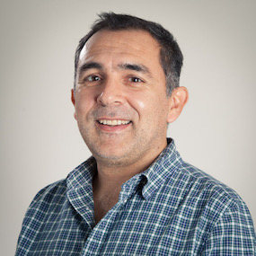
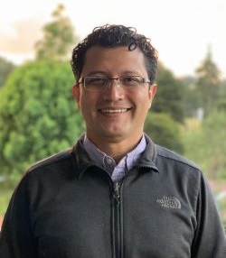
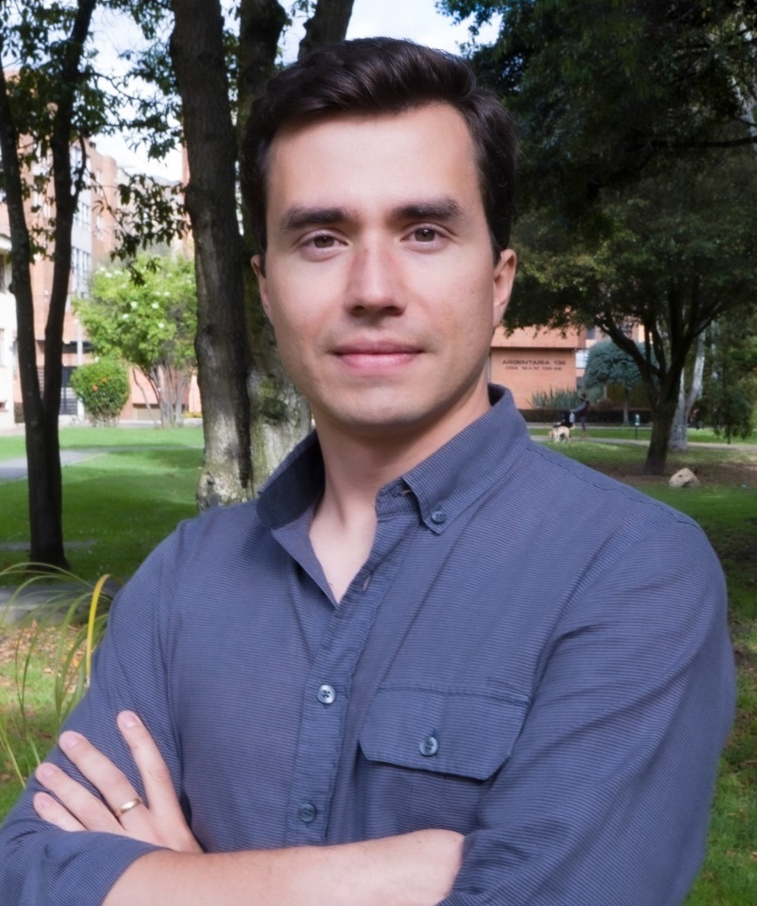
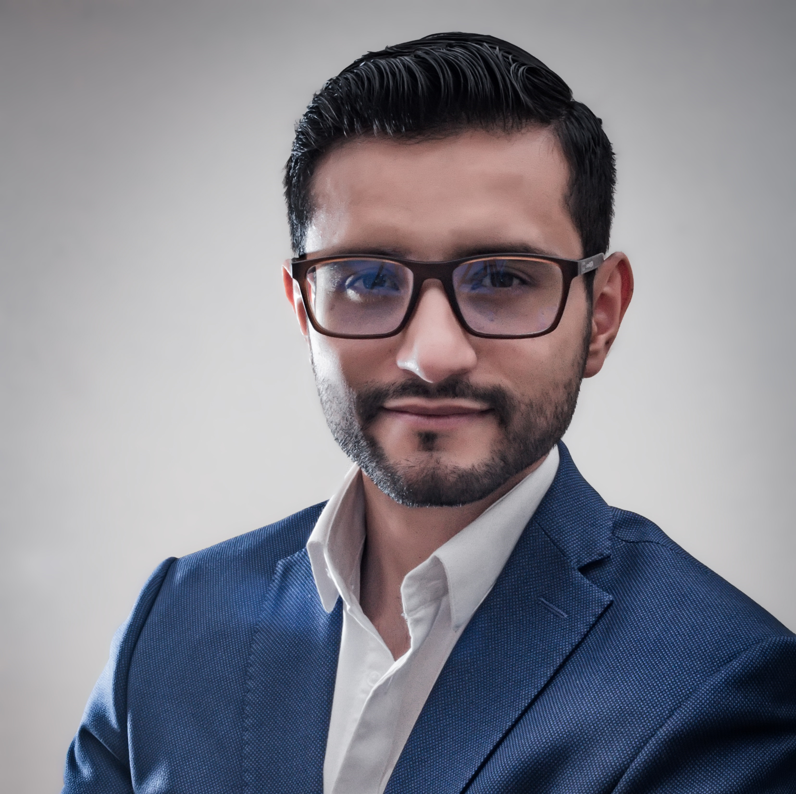
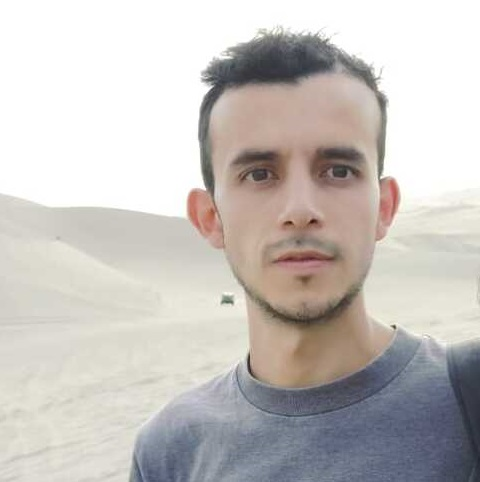
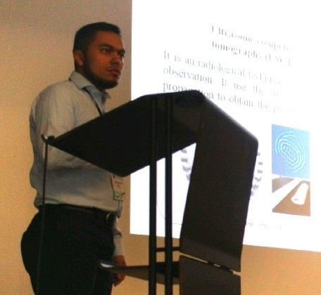
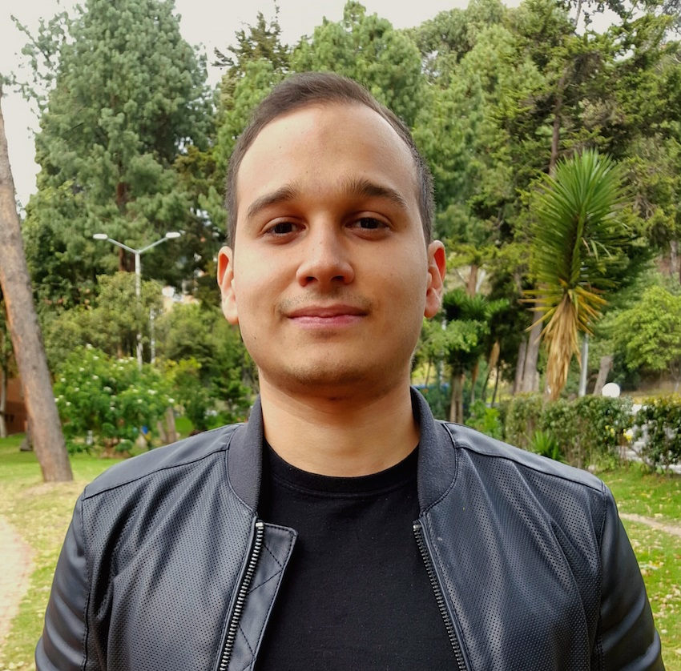

## Director

### Fabio A. González O., Eng, M.Sc., Ph.D.
Prof. González has many interests, including Quantum Computing, Machine Learning, 
Image Automatic Processing and Natural Language Analysis.
His academic career includes: Systems Engineer degree, M.Sc. in Mathematics, M.Sc. in Computer Science, and a Ph.D. in Computer Science.
* __Web Site:__ https://dis.unal.edu.co/~fgonza/
* __GitHub:__ https://github.com/fagonzalezo
* __Linkedin:__ https://www.linkedin.com/in/fabio-gonzalez-16239a15/
* __Contact:__ fagonzalezo@unal.edu.co

## Associated Professor

### Jorge Eliécer Camargo, Eng, M.Eng, Ph.D.
Prof. Camargo interests include Cybersecurity, Machine Learning and Big Data.
His academic career includes: Systems Engineer degree, M.Sc. in Systems Engineering and Ph.D. in Systems Engineering.
* __Web Site:__ https://dis.unal.edu.co/~jecamargom/
* __GitHub:__ https://github.com/camargoj
* __Linkedin:__ https://co.linkedin.com/in/jorge-camargo-77b10824
* __Contact:__ jecamargom@unal.edu.co

## Ph.D. Students

### Santiago Toledo Cortés
Degree in Mathematics, M.Sc. in Applied Mathematics, Ph.D. (C) in Systems Engineering and Computer Science. 
Santiago's interests include Machine Learning, Differential Geometry, Image Automatic Processing and Natural Language Processing.
* __Web Site:__ https://sites.google.com/unal.edu.co/santiagotoledo-cortes/
* __Linkedin:__ https://www.linkedin.com/in/santiago-toledo-cort%C3%A9s-66964a54/
* __Contact:__ jstoledoc@unal.edu.co

### Joseph Alejandro Gallego
Degree in Systems and Computer Engineering, M.Sc. in Systems Engineering, Ph.D. (C) in Systems Engineering and Computer Science. 
Joseph's interests include Machine Learning, Bayesian Statistics, Deep Learning, and Quantum Computing.
* __Github:__ https://github.com/Joaggi
* __Linkedin:__ https://www.linkedin.com/in/joagalejo/
* __Contact:__ jagallegom@unal.edu.co

## M.Sc. Students

### Diana Carolina Cabrera
Degree in Mechatronic Engineering. Magister (C) in Systems and Computing Engineering.
* __Web Site:__ https://dianacarolinacabrera.github.io/
* __Github:__ https://github.com/DianaCarolinaCabrera
* __Linkedin:__ https://www.linkedin.com/in/diana-cct/
* __Contact:__ dcabrerat@unal.edu.co

### Juan Sebastián Neiza
Magister (C) in Systems and Computing Engineering.
* __Linkedin:__ https://www.linkedin.com/in/jsneiza/
* __Contact:__ jsneizam@unal.edu.co

### Diego Useche Reyes
Degree in Physics. Degree in Mathmatics. M.Sc. in Physics. Magister (C) in Systems and Computing Engineering.
* __Github:__ https://github.com/diegour1
* __Contact:__ diusecher@unal.edu.co

### Juan Sebastián Malagón
Degree in Biomedical Engineering. Magister (C) in Biomedical Engineering.
* __Linkedin:__ https://www.linkedin.com/in/juan-sebastian-malag%C3%B3n-torres-86039a164/
* __Contact:__ jmalagont@unal.edu.co

### Oscar Alberto Bustos
Degree in Systems and Computing Engineering. Magister (C) in Systems and Computing Engineering.
* __Github:__ https://github.com/oabustosb
* __Linkedin:__ https://www.linkedin.com/in/oscar-alberto-bustos-bri%C3%B1ez-a51758219/
* __Contact:__ oabustosb@unal.edu.co

### Sebastián Medina Carrillo
Degree in Systems and Computing Engineering. Magister (C) in Systems and Computing Engineering.
* __Github:__ https://github.com/srmedinac
* __Linkedin:__ https://www.linkedin.com/in/srmedinac/
* __Contact:__ srmedinac@unal.edu.co

### José Miguel Arrieta Ramos
Degree in Systems and Computing Engineering. Magister (C) in Systems and Computing Engineering.
* __Github:__ https://github.com/jmarrietar
* __Linkedin:__ https://www.linkedin.com/in/jmarrietar/
* __Contact:__ jmarrietar@unal.edu.co

### Víctor Alfonso Arias
Degree in Mechatronic Engineering. Magister (C) in Systems and Computing Engineering.
* __Linkedin:__ https://www.linkedin.com/in/viarisv/
* __Contact:__ viariasv@unal.edu.co

### Melissa de la Pava Rodríguez
Degree in Chemical Engineering. Magister (C) in Systems and Computing Engineering.
* __Linkedin:__ https://www.linkedin.com/in/melissa-de-la-pava-rodr%C3%ADguez-b74174220/?originalSubdomain=co
* __Contact:__ medel@unal.edu.co

### Miguel Alexander Chitiva
Magister (C) in Systems and Computing Engineering.
* __Linkedin:__ https://www.linkedin.com/in/miguel-chitiva/
* __Contact:__ machitivad@unal.edu.co

### Lillian Daniela Beltrán Barrera
Degree in Statistics. Magister (C) in Systems and Computing Engineering.
* __Linkedin:__ https://www.linkedin.com/in/lillian-daniela-beltr%C3%A1n-barrera-47726a15a/
* __Contact:__ ldbeltranb@unal.edu.co

### Nicolás Buitrago Beltrán
Degree in Systems and Computing Engineering. Magister (C) in Systems and Computing Engineering.
* __Github:__ https://github.com/nbuitragob
* __Contact:__ nbuitragob@unal.edu.co

### Landneyker Betancourth Castro
Degree in Electronic Engineering. Magister (C) in Systems and Computing Engineering.
* __Github:__ https://github.com/lbetancourthc
* __Linkedin:__ https://www.linkedin.com/in/landneyker-betancourth-b3843b231/
* __Contact:__ lbetancourthc@unal.edu.co

### Glenn Harry Amaya Cruz
Degree in Statistics. Magister (C) in Systems and Computing Engineering.
* __Linkedin:__ https://www.linkedin.com/in/glenn-cruz-4119bb127
* __Contact:__ ghamayac@unal.edu.co

## Former Members

* __Andrés Daniel Pérez__

    * Linkedin: https://www.linkedin.com/in/andapzz/
    * Contact: anperezpe@unal.edu.co

* __Oscar Julián Perdomo__

    * Linkedin: https://www.linkedin.com/in/oscar-juli%C3%A1n-perdomo-charry-4634b0a0/
    * Contact: oscarj.perdomo@urosario.edu.co

* __Andrés Enrique Rosso__

    * Contact: aerossom@unal.edu.co

* __Elkin Alejandro Cruz__

    * Contact: elacruzca@unal.edu.co

* __Juan Felipe Baquero__

    * Linkedin: https://www.linkedin.com/in/jfbaquero/

* __Víctor Hugo Contreras__
    * Linkedin: https://www.linkedin.com/in/victor-contreras-50045397/
    * Contact: vhcontreraso@unal.edu.co

* __Mónica Patricia Pineda__
    * Linkedin: https://www.linkedin.com/in/mppinedav/
    * Contact: mppinedav@unal.edu.co

* __Iván Yesid Castellanos__

    * Linkedin: https://www.linkedin.com/in/iycastellanosm/

* __Juan Sebastián Lara__

    * Linkedin: https://www.linkedin.com/in/juan-sebastian-lara-ramirez-43570a214/
    * Contact: julara@unal.edu.co

* __Daniel Alfonso Garavito__

    * Linkedin: https://www.linkedin.com/in/daniel-alfonso-garavito-jim%C3%A9nez/
    * Contact: dagaravitoj@unal.edu.co

* __Sebastián Ernesto Sierra Loaiza__

    * Linkedin: https://www.linkedin.com/in/ssierral/
    * Contact: ssierral@unal.edu.co

* 

* __Jorge Andrés Vanegas Ramírez__
* __John Edilson Arévalo Ovalle__
* __Claudia J. Becerra__
* __Lady Viviana Beltrán Beltrán__
* __Juan Sebastian Otálora Montenegro__
* __Ángel Alfonso Cruz Roa__
* __Sergio Gonzalo Jiménez Vargas__
* __Johan David Rodríguez__
* __Lina Fernanda Rosales__
* __Fredy Huberto Díaz__

